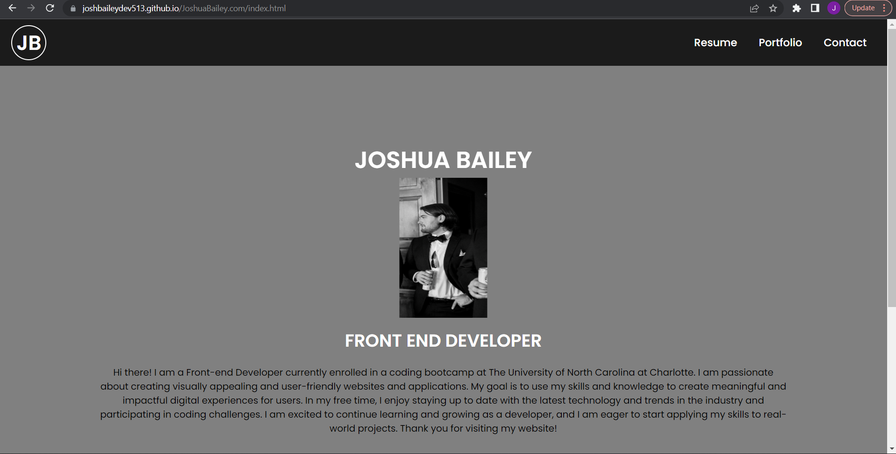

# Weekly Challenge 2

## Description

The motivation behind this weekly challenge was about using what we have learned so far in HTML and CSS to create a web application from scratch. In this case, we were tasked with building a portfolio page which we can add to as the course progresses. With these points in mind, we will need to specifically apply some of the core skills we've recently learned: flexbox, media queries, and CSS variables. 

The goal of this challenge was to create a portfolio of work which will showcase our skills and talents to future employers. In this field, an effective portfolio highlights your strongest work as well as the thought processes behind it and is most cases can help one stand apart when applying to roles or positions. 

In this specific challenge, the main acceptance criteria were as follows:
- As and employer, I want to view a potential employees deployed portfolio and work smaples.
- This portfolio page must have the following information: Developers Name, a photo or avatar, links to sections about them/their work, and how to contact them.
- When the links in the navigation pane are clicked, the UI brings you to that specific section
- In the portfolio page, each specific Image has a title about previous applications along with the first application appearing larger than the rest (if applicable- meaning if you have work to show already- I put Lorem Ipsum in as a placeholder)
- The pages is in a responsive layout so that it adapts to certain viewports when being resized on various screens or devices. 
- Comments in HTML and CSS
- All icon and image elements must have alt attributes
- All heading attributes must fall in sequential order
- Must have a concise and descriptive title

The main goal this challenge would be to have something that we can add to throughout the class to use for interviews and after graduation for further use. 

Through this second challenge, I learned more in depth CSS and how I can make websites responsive with media queries and visually stimulating with flex boxes/CSS variables. Through this application build, I was able to put my skills to the test with CSS, Flex Boxes, and HTML to mimic a full build for a client that I may experience within a future position. 

## Installation

To get this project installed you can find the core code at https://github.com/joshbaileydev513/JoshuaBailey.com . From there, click the green <>Code dropdown button and copy the HTTPS or SSH link within Clone. Once you have that copied, open up your CLI or GitBash and run the following commands:

git clone (paste your HTTPS or SSH link)

Or you can view the live page here: https://joshbaileydev513.github.io/JoshuaBailey.com/index.html

## Usage

To use the main functionality of this page, you can click the three sections (Resume, Portfolio, Contact) in the top right of the nav bar to take you to those spots on the page to learn more information on that topic. To bring you back to the main page with my picture/info, just click the JB inside a circle in the top left. Below is a picture of what the deployed webpage will look like. 

Additionally, you can find the live page at this link: https://joshbaileydev513.github.io/JoshuaBailey.com/index.html

## Credits

All credits to both of my instructors Jack and Jay who have been a huge help during class so far. Additional credit to EdX for providing the starter code for the course and assignment. 

## License

Please refer to the LICENSE in the repo.
